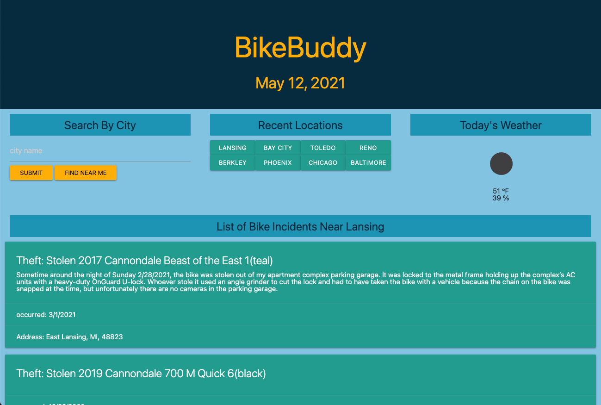

# BikeBuddy
BikeBuddy the cyclist commuters best friend! This app will provide the user with the weather, and bike incidents in their desired search area. This app will help daily commuters avoid dangerous areas, safety concerns, and closed down roads. Safe travels.

https://bdstpierre.github.io/bike-buddy/

# User Story
AS a BICYCLE COMMUTER 
I WANT information about local obstacles
SO THAT I can plan a safe route

AS a BICYCLE COMMUTER 
I WANT to information about local thefts
SO THAT I can plan a safe route

AS a BICYCLE COMMUTER who uses public transit
I WANT the ability to easily search safety data for other areas
SO THAT I can plan safe routes further away 

AS a BICYCLE COMMUTER
I WANT to save a certain number of recent searches for reference
SO THAT I can easily get the latest data for frequently visited locations

AS a BICYCLE COMMUTER
I WANT the ability to check the weather
SO THAT I can plan the appropriate wardrobe/accessories

# Acceptance Criteria 
GIVEN a bicycle dashboard with form inputs 
WHEN I search for a city/area
THEN I am presented with information about local obstacles

GIVEN a bicycle dashboard with form inputs 
WHEN I search for a city/area 
THEN I am presented with information about local thefts

GIVEN a bicycle dashboard with form inputs 
WHEN I search for a city/area 
THEN that location is added to my search history

WHEN I click on an area in my search history
THEN I am presented again with the latest information for that area 

# Installation
API keys for openweathermap.org should be installed to fully utilize application.

# Authors
* Barry St Pierre - programming
* Ian Hennssey -  programming
* Jane Rapley - html & CSS
* Karl Stafford - html & CSS
* Lauren Marcienk - html & CSS

# Built with
* jQuery
* Moment
* Materialize
* Bikewise API
* OpenWeatherMap
